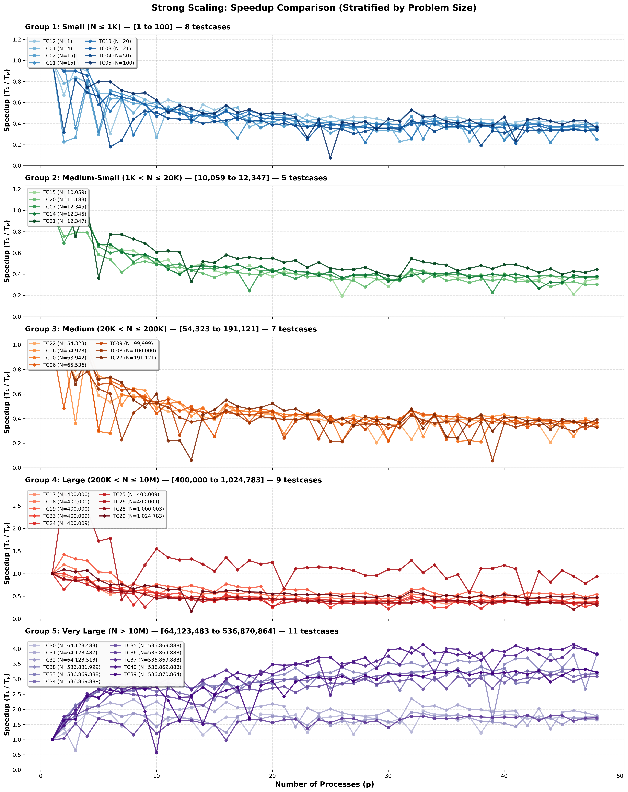

# HW1: MPI Odd-Even Sort

## Objective

Sort a binary array of 32-bit floating-point values across multiple MPI ranks.
The program partitions the input, performs local sorting and neighbor
merge-split phases, and writes the distributed result with MPI-IO.

## Implementation

The portfolio-facing implementation is `src/mpi_odd_even_sort.cc`. It keeps
the submitted algorithm's non-profiling path: MPI-IO, an active communicator
limited to ranks with data, boundary-first exchanges, partial merge-splits,
buffer pointer swaps, and a collective sortedness check. Profiling
instrumentation and timing-output branches are intentionally omitted from the
canonical source view.

`submission/hw1.cc` is the original grading-time source. It remains unchanged
with its original Makefile and optional profiling path.

## Layout

- `src/mpi_odd_even_sort.cc`: canonical, profiling-free implementation
- `Makefile`: builds the canonical implementation
- `submission/`: original grading-time source, Makefile, and module list
- `submission/report.pdf`: byte-exact submitted report
- `results/scaling-summary.csv`: per-case scaling summary
- `results/strong-scaling.png`: grouped strong-scaling overview

## Build and Run

Build the canonical implementation:

```bash
make
srun -N <nodes> -n <ranks> ./mpi_odd_even_sort \
  <element-count> <input.bin> <output.bin>
```

The input and output files are binary arrays of 32-bit `float` values.

To reproduce the grading-time build instead:

```bash
make -C submission
srun -N <nodes> -n <ranks> ./submission/hw1 \
  <element-count> <input.bin> <output.bin>
```

The submission Makefile also provides `make -C submission prof` for the
course-cluster profiling configuration.

## Selected Result

The retained figure groups recorded speedup curves by problem size. Small
inputs are dominated by MPI overhead, while the largest cases show the useful
scaling range of the submitted implementation. Measurements are specific to
the course cluster.



## Environment

Both Makefiles expect an MPI C++ compiler, C++17, and the Boost Spreadsort
header. They use `-march=native`, so generated binaries are specific to the
build host.

`submission/` preserves the grading-time source, build files, and
[`report.pdf`](submission/report.pdf) byte-for-byte. The report intentionally
retains its original author identity; hash provenance is recorded in the root
[`SUBMISSIONS.md`](../../SUBMISSIONS.md). Development variants and raw
measurements remain on the private legacy snapshot.
