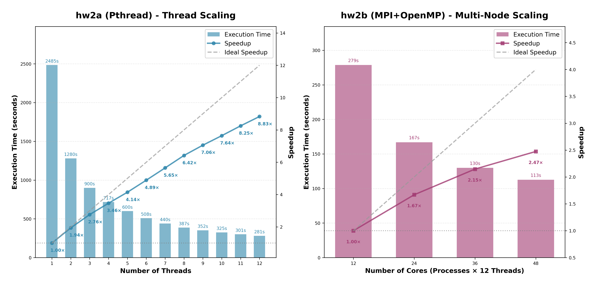

# HW2: Parallel Mandelbrot Renderer

## Objective

Render a selected region of the Mandelbrot set to a PNG image using both a
shared-memory implementation and a distributed hybrid implementation.

## Implementations

- [`mandelbrot_pthreads.cc`](src/mandelbrot_pthreads.cc): Pthreads
  implementation using the CPUs available through the process affinity mask
- [`mandelbrot_mpi_openmp.cc`](src/mandelbrot_mpi_openmp.cc): MPI plus OpenMP
  implementation that distributes image rows across ranks and gathers the
  completed image

Both programs accept the same image bounds and dimensions and use libpng for
output. They share the SSE2 row kernel, argument parser, and PNG writer under
`src/`.

## Layout

- `src/`: canonical, profiling-free portfolio implementation
- `submission/`: unmodified grading-time sources and build files
- `results/load-balance-*`: scheduling summaries for Pthreads and MPI+OpenMP
- `results/scalability-*`: process/thread scaling summary and figures
- `results/unroll-*`: loop-unrolling summary and figure

## Build and Run

```bash
make

srun -n 1 -c 12 ./hw2a output.png \
  <iterations> <left> <right> <lower> <upper> <width> <height>

srun -n 4 -c 12 ./hw2b output.png \
  <iterations> <left> <right> <lower> <upper> <width> <height>
```

Rank and CPU counts in the examples match the recorded commands and can be
changed for another allocation.

The clean sources preserve the submitted SIMD kernel and scheduling strategy
while removing NVTX ranges and report-specific timing summaries. They also use
a combined OpenMP parallel-for construct, request MPI's funneled thread level,
and validate command-line arguments. `submission/` remains available to show
the exact grading-time artifacts.

## Selected Results

The compact result set records load-balancing, scalability, and loop-unrolling
comparisons without retaining dozens of sources that differed only by a chunk
size, scheduling clause, or unroll factor. The measurements use private course
test cases, predate the portfolio refactor, and are hardware-specific.



## Environment

Building requires a C++17 compiler, Pthreads, OpenMP, MPI compiler wrappers,
and libpng. The root Makefile uses `-march=native`. The original measurements
also assumed Slurm and the course cluster configuration.

`submission/` preserves the grading-time source and build files. The submitted
report, which contains a student identifier, remains only on the private
legacy snapshot, together with the parameter-sweep sources and runners.
