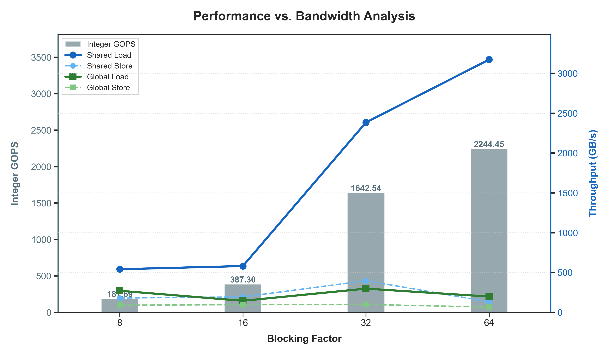

# HW3: Blocked Floyd-Warshall

## Objective

Compute all-pairs shortest paths for a weighted directed graph with a blocked
Floyd-Warshall algorithm, then compare CPU, single-GPU, and two-GPU versions.

## Implementations

- `src/hw3-1.cc`: OpenMP CPU implementation
- `src/hw3-2.cu` and `src/hw3-2.hip`: single-GPU CUDA and HIP implementations
- `src/hw3-3.cu` and `src/hw3-3.hip`: two-GPU implementations with two OpenMP host
  threads, one per device

All five versions read a binary graph file and write the resulting distance
matrix to a binary output file. The CUDA and HIP implementations retain the
submitted kernels, memory layouts, streams, events, and peer-to-peer transfers.

## Layout

- `src/`: primary, portfolio-facing sources
- `submission/`: unmodified grading-time sources and Makefile
- `results/`: selected CUDA and HIP blocking-factor measurements
- `visualizations/blocked-floyd-warshall.html`: interactive view of the blocked
  algorithm's phases

## Build and Run

```bash
make hw3-1
make hw3-2 hw3-3
make hw3-2-amd hw3-3-amd

./build/hw3-1 <input.bin> <output.bin>
./build/hw3-2 <input.bin> <output.bin>
./build/hw3-2-amd <input.bin> <output.bin>
```

Running `make` builds all five targets. Build an individual target when only
one accelerator toolchain is available. `hw3-3` and `hw3-3-amd` require two
visible GPUs.

## Selected Results

The retained CUDA and HIP sweeps compare throughput and memory traffic across
blocking factors. They summarize the optimization study without carrying the
many source copies that differed only by launch configuration.



## Environment

The submitted Makefile targets NVIDIA `sm_61` and AMD `gfx908`, and requires
OpenMP, CUDA, and HIP toolchains to build every target. Build only the target
supported by the available machine, or adjust the architecture flag locally.
The original test inputs and scheduler setup belong to the course environment
and are not included.

`src/` starts from the submitted sources. It validates command-line and binary
file I/O, uses overflow-safe matrix sizes and offsets, and removes the CPU
version's round-by-round progress output; the algorithms and GPU
synchronization are unchanged. GPU runtime calls are not comprehensively
wrapped, so accelerator failures still require checking the CUDA or HIP runtime
diagnostics. `submission/` preserves the grading-time source and build files
byte for byte.

The submitted report, which contains a student identifier, remains only on the
private legacy snapshot, together with profiling and exploratory source
variants.
