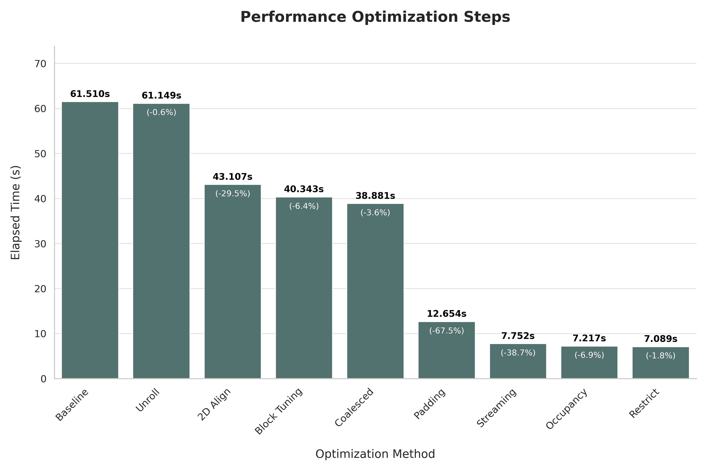

# HW4: FlashAttention

## Objective

Implement exact attention on NVIDIA and AMD GPUs while avoiding storage of the
full attention matrix in device memory. The programs read batches of Q, K, and
V matrices from a binary file and write the resulting O matrices in binary
form.

## Implementations

The CUDA and HIP versions process the attention matrix in row and column tiles,
stage Q, K, and V data in shared memory, and update the softmax state across
tiles. They partition batches across multiple streams so transfers and kernels
can be queued independently; actual overlap depends on the runtime, device, and
host-memory behavior. CUDA and HIP use different tile dimensions selected for
their target devices.

## Layout

- `src/`: canonical CUDA and HIP implementations used by the Makefile
- `submission/`: grading-time implementations retained for provenance
- `submission/report.pdf`: byte-exact submitted report
- `Makefile`: builds the canonical CUDA and HIP implementations
- `results/`: selected optimization summary and figure
- `visualizations/flash-attention.html`: interactive tiled-attention
  visualization

The canonical sources preserve the submitted kernels, tuned launch
configuration, synchronization behavior, and online-softmax computation. They
add checked argument parsing, file I/O, size arithmetic, allocation, and GPU
runtime operations around that computation. Inactive profiling branches and
obsolete implementations that had already been commented out are omitted from
`src/`; they remain available in `submission/` and the legacy history.

The canonical kernels intentionally support full tiles only. Both programs
require `B > 0`, `N > 0`, and `1 <= d <= 64`. CUDA additionally requires `N`
to be divisible by its `BR=128` and `BC=16` tiles; HIP requires divisibility by
`BR=64` and `BC=8`. Unsupported dimensions are rejected before allocation or
kernel launch, avoiding partial-tile and fixed-register-array out-of-bounds
access.

## Build and Run

The Makefile builds the canonical sources:

```bash
make hw4
make hw4-amd

./hw4 <input.bin> <output.bin>
./hw4-amd <input.bin> <output.bin>
```

The default `make` target builds both GPU implementations.

## Selected Result

The retained summary shows the measured progression from the CUDA baseline to
the submitted configuration. Source snapshots for every intermediate step are
kept in the private legacy history rather than the public tree.



## Environment

The Makefile targets NVIDIA `sm_61` with CUDA C++11 and AMD `gfx908` with HIP
C++14. A compatible GPU toolchain and device are required. Architecture flags
must be changed when building for other GPU generations.

`submission/` preserves the grading-time source files and is not used by the
default build. Its byte-exact [`report.pdf`](submission/report.pdf)
intentionally retains the original author identity; hash provenance is in the
root [`SUBMISSIONS.md`](../../SUBMISSIONS.md). Tile sweeps and intermediate
kernels remain only on the private legacy snapshot.
