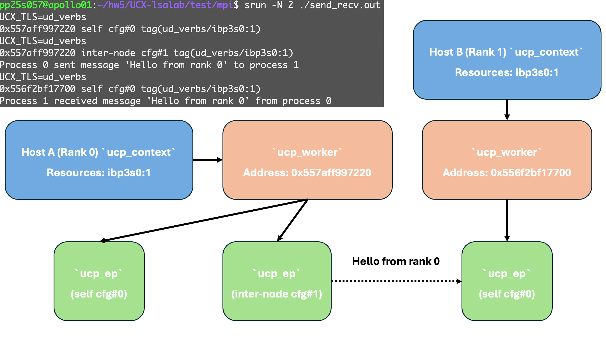
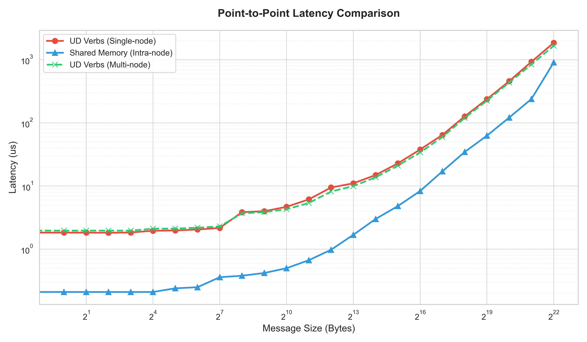
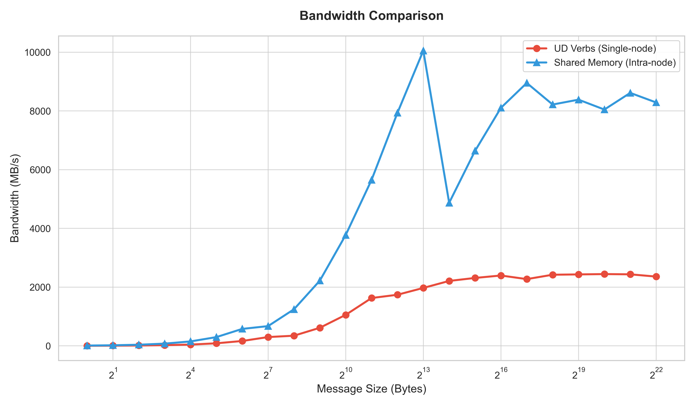
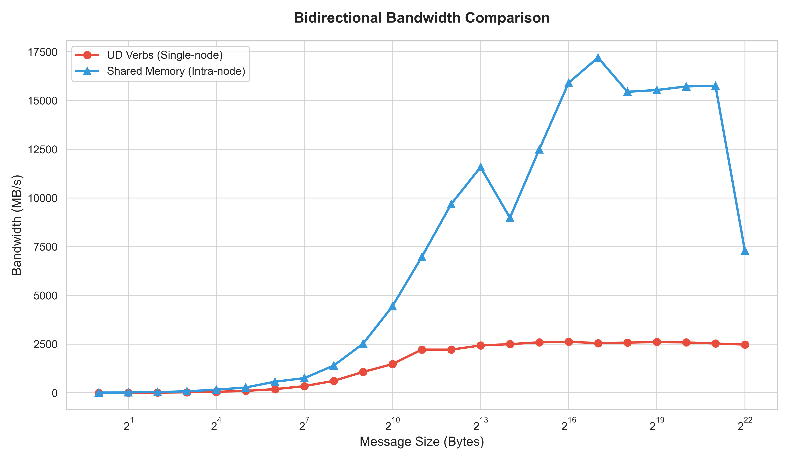
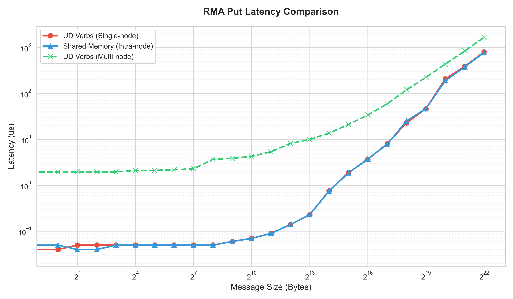
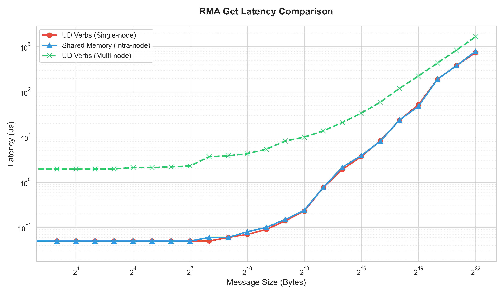
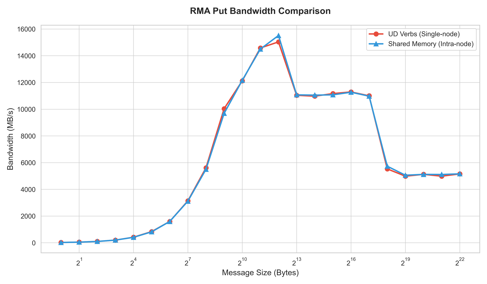

# UCX Transport Selection and Intra-Node Performance

This report documents a small UCX instrumentation patch and a set of OSU
Micro-Benchmark runs. It is a portfolio-oriented summary of the submitted work;
the original course prompts and personal identifiers are intentionally omitted.

## Scope

The work addressed two questions:

1. Where does UCX read the `UCX_TLS` setting, and when is the selected endpoint
   configuration observable?
2. How do automatically selected transports and forced `ud_verbs` compare for
   two MPI ranks on one node?



## Instrumentation Patch

The submitted patch is preserved as
[`submission/hw5.diff`](submission/hw5.diff). It changes two UCX source files:

- `src/ucs/config/parser.c` adds a dedicated print flag and emits the current
  `UCX_TLS` environment value through the existing configuration printer.
- `src/ucp/core/ucp_worker.c` invokes that configuration printer from
  `ucp_worker_print_used_tls`, then writes the endpoint configuration string to
  standard output.

The observed call path is:

```text
ucp_worker_get_ep_config
  -> ucp_worker_print_used_tls
     -> ucp_config_print
        -> ucs_config_parser_print_opts
```

This places the diagnostic beside the code that records a worker endpoint
configuration. The first line reports the user constraint; the second reports
the configuration selected by UCX for that endpoint. The patch is diagnostic
only and is not proposed as a general UCX logging interface.

## Experiment Design

The checked-in [`run_osu.sh`](run_osu.sh) runs two local MPI ranks for each
of these OSU benchmarks:

| Group | Benchmarks |
| --- | --- |
| Point-to-point | `osu_latency`, `osu_bw`, `osu_bibw` |
| One-sided | `osu_put_latency`, `osu_get_latency`, `osu_put_bw` |

Each benchmark is run with two transport settings:

- `UCX_TLS=all`, allowing UCX to choose among the transports available on the
  host. The instrumentation output must be checked to determine what it chose.
- `UCX_TLS=ud_verbs`, constraining communication to the verbs transport used in
  the course environment.

The Slurm script [`run_multi_node.batch`](run_multi_node.batch) records an
additional two-node latency series. All results depend on the UCX build, MPI
integration, process placement, devices, and host hardware used for the run.

## Recorded Results

### Point-to-Point







For the recorded single-node run, the automatically selected configuration had
lower small-message latency and higher large-message throughput than forced
`ud_verbs`. The worker diagnostics reported shared-memory transports for the
automatic case in this environment. That observation supports a transport-path
explanation, but the benchmark alone does not isolate individual sources of
overhead.

### One-Sided Communication







The RMA curves show a smaller latency gap at some message sizes than the
point-to-point curves. These measurements establish the end-to-end behavior of
this software and hardware configuration. They do not, by themselves, prove a
specific driver shortcut, direct `memcpy` path, or hardware-offload mechanism;
that would require tracing or profiler evidence.

The two-node latency data is retained in
[`osu_results_multi/multi_node_latency.csv`](osu_results_multi/multi_node_latency.csv).
It provides a separate inter-node reference rather than a portable estimate for
other clusters.

## Reproduce

The scripts contain paths and module names from the original course cluster.
After adapting `OSU_DIR`, `OUT_DIR`, module names, and Slurm partition settings:

```bash
bash run_osu.sh
python3 plot.py
sbatch run_multi_node.batch
```

Merged benchmark CSV files are under `osu_results/`; generated figures are
under `plots/`. The runner regenerates raw logs when needed. Preserve rank
placement when comparing local and remote runs, and record the UCX-selected
transport alongside every result.

## Limitations

- `UCX_TLS=all` is a selection policy, not a synonym for one fixed transport.
- The committed results come from one course-cluster configuration.
- No UCX trace or hardware profile was captured to validate lower-level causal
  claims about the RMA data path.
- The patch prints directly to standard output and is intended for assignment
  observation, not production logging.

## References

- [OpenUCX FAQ: architecture and transport selection](https://openucx.readthedocs.io/en/master/faq.html)
- [OSU Micro-Benchmarks](https://mvapich.cse.ohio-state.edu/benchmarks/)
